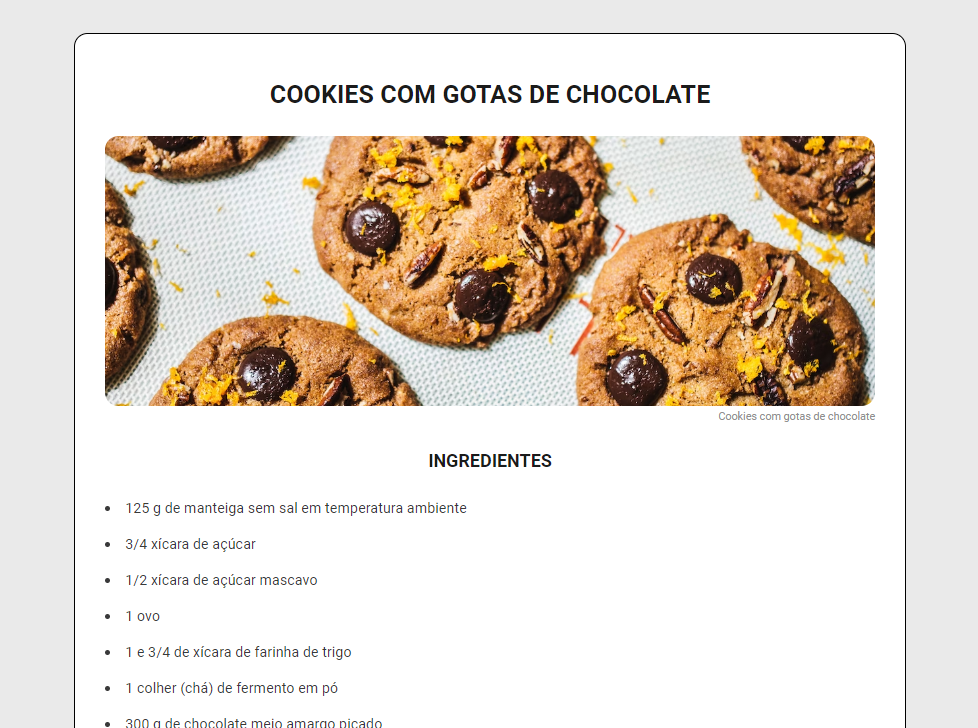

# Página de Receita

## Descrição do Projeto

Uma página de receita realizada a partir das diretrizes do <a href="https://efficient-sloth-d85.notion.site/Desafio-Piloto-P-gina-de-Receita-15acc6a34f744484a2e64a1f115bfbae">desafio da Rocketseat!</a>

<h1 align="center">
  
</h1>

### 🛠 Tecnologias

As seguintes ferramentas foram usadas na construção do projeto:

- [HTML](https://developer.mozilla.org/pt-BR/docs/Web/HTML)
- [CSS](https://developer.mozilla.org/pt-BR/docs/Web/CSS)

### Autor
---

Feito com ❤️ por Nathalia Azevedo 👋🏽 Entre em contato!

